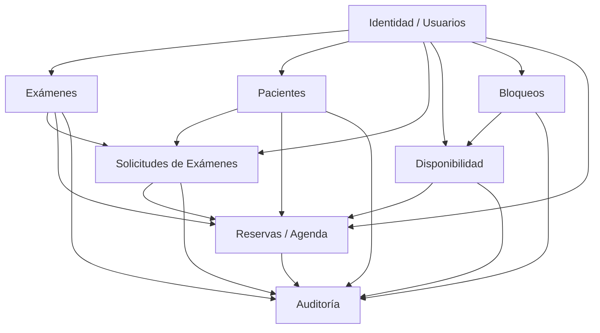
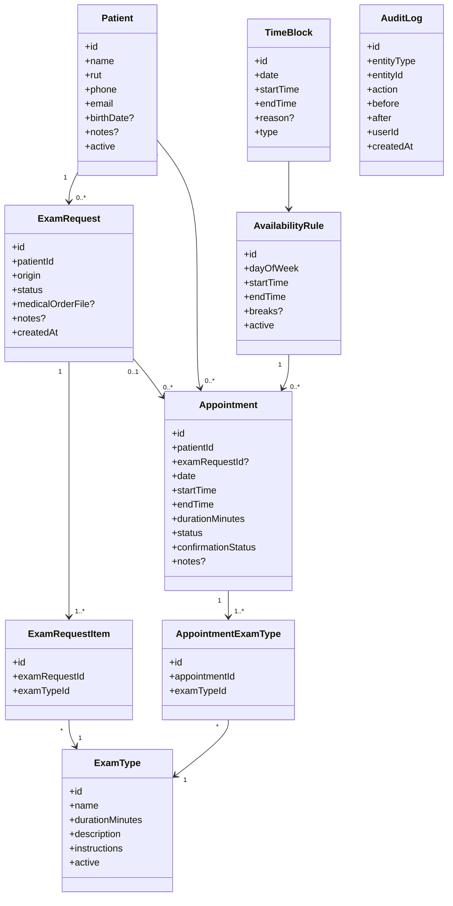
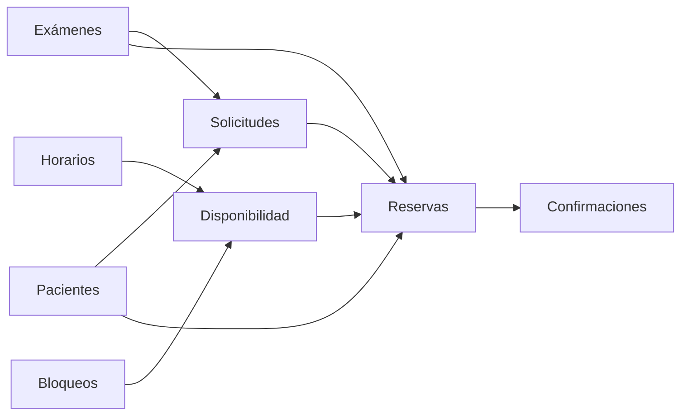

# agendamiento

# Mapa de dominios e interacciones — Agenda de Exámenes Ópticos

## 1. Vista general de dominios

### Lectura del diagrama

- **Identidad / Usuarios** permite saber quién opera el sistema.
- **Exámenes** define el catálogo de tipos de examen.
- **Pacientes** mantiene la información de las personas atendidas.
- **Solicitudes de Exámenes** representa lo que fue indicado por Doc. Palma o por un paciente externo.
- **Disponibilidad** define horarios base de atención.
- **Bloqueos** modifica la disponibilidad real.
- **Reservas / Agenda** representa la hora agendada por el paciente.
- **Auditoría** registra cambios sobre módulos modificables.

---

## 2. Vista conceptual principal

---

## 3. Relaciones explicadas en lenguaje simple

### Paciente
Es la persona que será atendida.

Se relaciona con:

- muchas **solicitudes**;
- muchas **reservas**.

---

### Tipo de examen
Es el catálogo base de exámenes que ofrece la consulta.

Se relaciona con:

- los ítems de una **solicitud**;
- los ítems de una **reserva**.

---

### Solicitud de exámenes
Representa el requerimiento original.

Puede venir desde:

- **Doc. Palma**
- **Paciente externo**

Contiene:

- un paciente;
- uno o varios exámenes solicitados;
- eventualmente una orden médica adjunta;
- un estado.

Una solicitud puede existir **antes** de que haya una reserva.

---

### Reserva / Appointment
Representa una hora concreta en la agenda.

Contiene:

- un paciente;
- opcionalmente una solicitud asociada;
- fecha y horario;
- duración total;
- estado;
- exámenes que efectivamente se realizarán.

Una reserva depende del cálculo de disponibilidad.

---

### Disponibilidad
Define las reglas base de atención:

- días;
- horario de inicio;
- horario de término;
- pausas.

No es una reserva, sino la base para construir la agenda disponible.

---

### Bloqueos
Son excepciones o interrupciones sobre la disponibilidad:

- bloqueo de un tramo horario;
- bloqueo de un día completo;
- vacaciones;
- colación;
- ajustes puntuales.

Los bloqueos alteran lo que el motor de disponibilidad puede ofrecer.

---

### Auditoría
Registra cambios relevantes de entidades modificables.

Ejemplos:

- creación de tipo de examen;
- edición de paciente;
- cambio de estado de una reserva;
- reagendamiento;
- desactivación de un examen.

---

## 4. Dependencias por etapa

### Lectura

- **Solicitudes** dependen de:
  - Exámenes
  - Pacientes

- **Disponibilidad** depende de:
  - Horarios
  - Bloqueos

- **Reservas** dependen de:
  - Solicitudes
  - Disponibilidad
  - Pacientes
  - Exámenes

- **Confirmaciones** dependen de:
  - Reservas existentes

---